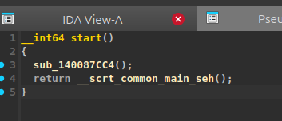
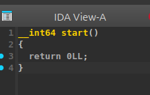

# anti_decompil_poc

A small proof of concept demonstrating a Hex-Rays switch-recovery issue that
can hide code from the IDA Pro decompiler without producing a warning.

The behavior is reproducible on **IDA Pro versions earlier than 9.5**. Switch
handling was improved in IDA Pro 9.5.

The technique is based on this Hex-Rays forum discussion:
[Wrong switch decompilation](https://community.hex-rays.com/t/wrong-switch-decompilation/610).

## The idea

An assembly-level `switch` is commonly implemented with a jump table. Each
table entry contains an address or a relative offset to a block of code.

A simplified dispatcher looks like this:

```asm
lea     r10, [jump_table]
movsxd  r11, dword ptr [r10 + rax*4]
add     r11, r10
jmp     r11
```

The registers have the following roles:

- `RAX` contains the selected case index.
- `R10` points to the jump table.
- `R11` receives the selected relative offset.
- `jmp r11` transfers control to the selected block.

For this proof of concept, the table contains two entries:

```asm
jump_table:
    dd original_code - jump_table
    dd return_stub   - jump_table
```

The first entry continues normal execution, while the second one points to a
small return stub:

```asm
original_code:
    jmp original_entry

return_stub:
    xor eax, eax
    ret
```

## Confusing Hex-Rays

The switch index register is overwritten after the table entry has already
been loaded, but before the final indirect jump:

```asm
lea     r10, [jump_table]
movsxd  r11, dword ptr [r10 + rax*4]
mov     eax, 1
add     r11, r10
jmp     r11
```

The processor has already used `RAX` when `movsxd` finishes. The selected
offset is stored in `R11`, so the later `mov eax, 1` cannot change the real jump
destination.

Affected Hex-Rays versions can nevertheless treat the new value of `EAX` as
the switch input. The decompiler assumes that the index is always `1`, removes
the first case as unreachable, and displays only the return stub:

```asm
return_stub:
    xor eax, eax
    ret
```

The disassembly still contains the original instructions, and the processor
still executes the original path. Only the decompiled representation is
misleading.

## What this POC does

The tool accepts one x86-64 `.exe` or `.elf` file and injects the dispatcher
around its executable entry point.

The patched ELF or PE header points directly to the new dispatcher. There is
no trampoline before it. At runtime, case 0 transfers control to the original,
unmodified entry point. Case 1 contains the return stub that affected Hex-Rays
versions may incorrectly display as the only reachable path.

The original file is never overwritten:
s
```text
program.elf -> program.patch.elf
program.exe -> program.patch.exe
```

## Build

```bash
cargo build --release
```

## Usage

```bash
target/release/anti_decompil_poc ./program.elf
```

or:

```bash
target/release/anti_decompil_poc ./program.exe
```

## Before



## After


